# gjoa Dark Mode — Architecture & Control Flow (BOOT → PAGE-LOAD)

## 1. Orientation

gjoa's dark mode is a **layered decision pipeline where the narrowest scope wins**. From widest to narrowest: (a) the **master switch** `gjoa.darkmode.enabled` either parks everything or lets the engine live; (b) the **Appearance mode** `gjoa.darkmode.mode` (`dark`/`uniform`/`system`/`light`/`off`) is the central lever — the chrome controller's `apply!` translates it into a fixed tuple of native + engine prefs; (c) those **engine knobs** (`invert.enabled`, `hybrid.default-invert`, `content-override`, the OKLCH-L band `bgLightness`/`fgLightness`, the RFP color-scheme exemption) drive the compiled servo cascade (patches 0009/0014) that does the actual pre-paint pixel inversion; (d) **per-site host lists** (`user.off` > `user.force-invert` > `user.force-native`, live only in Dark) and (e) the **curated fix registry** (`darkmode-fixes.json`, 1786 hosts) refine individual documents via the `GjoaDarkmode` Parent/Child actor pair, which writes a per-document `colorInversionOverride` (`active`/`inactive`/`none`) that the engine reads **before** the global flag. A page is decided by the most specific layer that has an opinion; everything below is a default the layers above can override.

## 2. Lifecycle Flowchart

```mermaid
graph TD
  subgraph BOOT["BOOT — baked omni.ja"]
    BAKE["branding.bjs pref-append<br/>compiles dark-mode-prefs.bjs<br/>→ bakes 16 gjoa.darkmode.* defaults<br/>into firefox-branding.js"]
    BAKE --> PREFS["baked defaults:<br/>enabled=true mode=dark<br/>invert.enabled=false<br/>hybrid.default-invert=false<br/>bgLightness=16 fgLightness=92<br/>force=false scrim.alpha=140 ..."]
  end

  subgraph CHROMEINIT["CHROME INIT — index.bjs (Lane 1)"]
    INIT["init-!  (load)"]
    INIT --> SDD["set-darkmode-defaults!<br/>re-set DEFAULT branch from chrome:<br/>enabled=true, mode=dark<br/>(only these 2)"]
    SDD --> APPLY
    INIT --> OBS["register observers:<br/>PREF-ENABLED, PREF-MODE<br/>+ matchMedia change (mql)"]
    INIT --> API["expose window.gjoaDarkMode<br/>{toggle,cycleMode,isEnabled,getMode}"]
    OBS -->|enabled/mode pref change<br/>or OS theme flip| APPLY
  end

  APPLY{"apply!<br/>read enabled? + mode-"}
  APPLY -->|"not enabled OR mode=off"| OFF
  APPLY -->|mode=system| SYSQ{"system-dark?<br/>matchMedia prefers-color-scheme:dark"}
  APPLY -->|"mode=uniform / engine"| UNI
  APPLY -->|mode=filter| FILT
  APPLY -->|mode=light| LIGHT
  APPLY -->|"mode=dark / :else (auto,hybrid,unknown)"| DARK

  SYSQ -->|matches true| SYSD
  SYSQ -->|matches false| SYSL

  OFF["OFF arm<br/>chrome-scheme=false<br/>content-override=2 (none)<br/>invert=false default-invert=false<br/>rfp-exempt=false · remove-filter"]
  SYSD["SYSTEM/dark-OS (acts like Dark)<br/>chrome-scheme=true<br/>content-override=0 (dark)<br/>invert=false default-invert=true<br/>rfp-exempt=true · remove-filter"]
  SYSL["SYSTEM/light-OS (acts like Light)<br/>chrome-scheme=false<br/>content-override=1 (light)<br/>invert=false default-invert=false<br/>rfp-exempt=false · remove-filter"]
  UNI["UNIFORM/engine<br/>chrome-scheme=true<br/>content-override=1 (light)<br/>invert=TRUE default-invert=false<br/>rfp-exempt=false · remove-filter<br/>(force LIGHT then luminance-invert ALL)"]
  FILT["FILTER (legacy, about:config)<br/>chrome-scheme=true<br/>content-override=0 (dark)<br/>invert=false default-invert=false<br/>rfp-exempt=true · apply-filter! (CSS invert)"]
  LIGHT["LIGHT<br/>chrome-scheme=false<br/>content-override=1 (light)<br/>invert=false default-invert=false<br/>rfp-exempt=false · remove-filter"]
  DARK["DARK / :else (DEFAULT)<br/>chrome-scheme=true<br/>content-override=0 (dark)<br/>invert=false default-invert=TRUE<br/>rfp-exempt=true · remove-filter<br/>per-site lists live"]

  OFF --> NATIVE
  SYSD --> NATIVE
  SYSL --> NATIVE
  UNI --> NATIVE
  FILT --> NATIVE
  LIGHT --> NATIVE
  DARK --> NATIVE

  subgraph NATIVEPREFS["NATIVE PREFS written by apply!"]
    NATIVE["layout.css.prefers-color-scheme.content-override (0/1/2)<br/>gjoa.darkmode.invert.enabled<br/>gjoa.darkmode.hybrid.default-invert<br/>privacy.resistFingerprinting.overrides (RFP exemption)"]
    RFPNOTE["RFP master spoofs prefers-color-scheme:light<br/>→ exemption token +AllTargets,-CSSPrefersColorScheme<br/>only written if pref empty or our token"]
    NATIVE -.-> RFPNOTE
  end

  NATIVE --> ENGINE

  subgraph ENGINEPAINT["PRE-PAINT ENGINE — patches 0009 / 0014 (Lane 3, compiled)"]
    ENGINE["nsPresContext::UpdateColorInversion<br/>derives mColorInversion:<br/>chrome/image-doc → false<br/>else BC colorInversionOverride<br/> &gt; hybrid.default-invert<br/> &gt; gjoa.darkmode.invert.enabled"]
    ENGINE --> HYBRID["ApplyHybridDefaultInvertIfThemeless<br/>(PresShell::Initialize, post first cascade)<br/>Tier-0: themeless = !(usedDark && rendersDark)<br/>usedDark=ColorScheme==Dark, rendersDark=opaque(α≠0) AND lum&lt;0.22"]
    HYBRID --> CASCADE["Color::to_computed_color invert tail<br/>if device().color_inversion():<br/>invert_color_luminance per Absolute color<br/>OKLCH-L band white→floor(0.16) black→ceil(0.92)<br/>preserve_under_hero keeps light hero text"]
    CASCADE --> BGCOMP["DefaultBackgroundColor<br/>compress canvas backstop (no flash)"]
  end

  BGCOMP --> DOCSTART

  subgraph ACTOR["PER-SITE ACTOR — GjoaDarkmode (document-start → post-load)"]
    DOCSTART["Child.handleEvent · DOMWindowCreated<br/>top-doc, master gate enabled?"]
    DOCSTART -->|gjoa-UI host| UIOFF["colorInversionOverride='inactive'"]
    DOCSTART -->|force mode| FORCE["EVERY page 'active'<br/>(except off/force-native excludes)<br/>_explicitApplied=true"]
    DOCSTART -->|normal| SYNC["#syncExplicitOverride (sync, pre-layout,<br/>gated on hybrid.default-invert)<br/>fix-overrides mirror &gt; user off<br/>&gt; force-invert &gt; force-native"]
    SYNC --> AEXP["#applyExplicit (async)<br/>sendQuery Darkmode:GetInject"]
    AEXP --> PEXP["Parent.#explicit (null unless<br/>#hybridActive + parseable host)<br/>fix-registry HARD override<br/>(active/inactive, NOT auto)<br/>&gt; user off &gt; force-invert &gt; force-native"]
    PEXP -->|explicit| EXPAPPLY["frame 1: #runInject (MAIN-world scriptlet)<br/>+ #injectSheet (css)<br/>+ colorInversionOverride<br/>_explicitApplied=true"]
    PEXP -->|"override=none (auto/no-fix)"| DEFERRED["defer to post-load refiner"]
  end

  EXPAPPLY --> DCL
  DEFERRED --> DCL

  subgraph REFINE["POST-LOAD REFINER — DOMContentLoaded"]
    DCL["Child.handleEvent · DOMContentLoaded<br/>await _explicitPromise"]
    DCL -->|_explicitApplied| NORMONLY["normalize only (skip refiner)"]
    DCL -->|"not explicit, 2× rAF"| MEAS["#measureAndRefine<br/>compute hasNativeDark (#pageIsDark)<br/>sendQuery Darkmode:Decide {w,h,hasNativeDark}"]
    MEAS --> AUTO["Parent.#auto<br/>#paintedMedianLstar (drawSnapshot, median L*)<br/>painted LIGHT (≥LIGHT_LSTAR=50,<br/>or 20 with 'auto' fix) → 'active' (DARK)<br/>painted DARK → 'none' (defer to engine)"]
    AUTO --> CAPPLY["Child applies returned css + override"]
    CAPPLY -->|override='active'| DIM["#dimLargeMedia<br/>large bright hero → 'inv' or 'dim'"]
    CAPPLY --> NORM["#maybeNormalizeContrast (if normalize.enabled)<br/>→ Parent.#normalize APCA retone (floor=45)"]
    CAPPLY --> IMG["#maybeRunImagePass (if image-analysis.enabled<br/>AND engine inverting) — default OFF"]
    DIM --> SPA["SPA backstop: ONE 2500ms re-measure<br/>upgrades light→active only, never retracts"]
  end
```



## 3. Sequence — Single Page Load (youtube.com, Dark mode)

```mermaid
sequenceDiagram
  participant Ctl as Chrome controller<br/>(index.bjs apply!)
  participant Pref as Native prefs
  participant Eng as Engine<br/>(nsPresContext / servo)
  participant Par as GjoaDarkmodeParent
  participant Chi as GjoaDarkmodeChild
  participant Page as youtube.com doc

  Note over Ctl: startup — mode="dark"
  Ctl->>Pref: content-override=0 (dark)
  Ctl->>Pref: hybrid.default-invert=true
  Ctl->>Pref: invert.enabled=false
  Ctl->>Pref: rfp overrides=+AllTargets,-CSSPrefersColorScheme
  Note over Par: loadFixes() → mirrorOverridesPref<br/>(youtube override='auto' → NOT mirrored)

  Note over Page: navigation begins
  Eng->>Pref: UpdateColorInversion reads<br/>BC override(none) > hybrid.default-invert(true)
  Eng->>Eng: ApplyHybridDefaultInvertIfThemeless<br/>(Tier-0 themeless test, pre-paint)

  Page->>Chi: DOMWindowCreated (document-start)
  Chi->>Chi: master gate enabled? (true)
  Chi->>Chi: #syncExplicitOverride (sync)<br/>fix-overrides pref has no hard youtube entry
  Chi->>Par: sendQuery Darkmode:GetInject
  Par->>Par: #explicit — youtube override='auto'<br/>falls through (no HARD override),<br/>but ships native css + inject scriptlet
  Par-->>Chi: {explicit, override, css, inject}<br/>(html[dark] scriptlet + #0f0f0f css are<br/>fix-REGISTRY data, not Child-authored)
  Chi->>Page: #runInject via Cu.Sandbox MAIN-world<br/>MutationObserver force-sets <html dark>
  Chi->>Page: #injectSheet css html,body{bg:#0f0f0f}
  Note over Page: YouTube's OWN dark theme activates<br/>(native, not engine-inverted)

  Page->>Chi: DOMContentLoaded
  Chi->>Chi: await _explicitPromise
  alt explicit applied (youtube native)
    Chi->>Chi: normalize-only (skip refiner)
  else auto/no-fix host
    Chi->>Chi: 2× rAF → #measureAndRefine
    Chi->>Par: Darkmode:Decide {w,h,hasNativeDark}
    Par->>Par: #auto → #paintedMedianLstar (drawSnapshot)
    Par-->>Chi: override ('active' if painted light, else 'none')
    Chi->>Page: set colorInversionOverride (+ #dimLargeMedia if active)
  end
  Note over Chi,Page: ONE 2500ms SPA re-measure (upgrade-only)
```

## 4. ASCII Lifecycle (terminal fallback)

```
BOOT (baked omni.ja)
  branding.bjs compiles dark-mode-prefs.bjs
    -> bakes 16 gjoa.darkmode.* defaults into firefox-branding.js
       enabled=true  mode=dark  invert.enabled=false  hybrid.default-invert=false
       bgLightness=16  fgLightness=92  force=false  scrim.alpha=140 ...
        |
        v
CHROME INIT  (index.bjs, Lane 1)
  init-!
    |-- set-darkmode-defaults!  (DEFAULT branch, chrome): enabled=true, mode=dark   [only these 2]
    |-- apply!                  (initial decision)
    |-- observers: PREF-ENABLED, PREF-MODE, matchMedia 'change'  --re-run--> apply!
    |-- window.gjoaDarkMode {toggle, cycleMode, isEnabled, getMode}
        |
        v
apply!  (read enabled? + mode-)   cond:
  +-------------------------------------------------------------------------------------------+
  | arm            | chrome-scheme | content-override | invert | default-invert | rfp | filter |
  |----------------|---------------|------------------|--------|----------------|-----|--------|
  | OFF / disabled | false         | 2 (none)         | false  | false          | off | remove |
  | SYSTEM dark-OS | true          | 0 (dark)         | false  | TRUE           | on  | remove |
  | SYSTEM light-OS| false         | 1 (light)        | false  | false          | off | remove |
  | UNIFORM/engine | true          | 1 (light)        | TRUE   | false          | off | remove |
  | FILTER (legacy)| true          | 0 (dark)         | false  | false          | on  | APPLY  |
  | LIGHT          | false         | 1 (light)        | false  | false          | off | remove |
  | DARK / :else   | true          | 0 (dark)         | false  | TRUE           | on  | remove |
  +-------------------------------------------------------------------------------------------+
   (SYSTEM arm first asks system-dark? = matchMedia prefers-color-scheme:dark)
        |
        v  writes native prefs
NATIVE PREFS
  layout.css.prefers-color-scheme.content-override  (0=dark 1=light 2=none)
  gjoa.darkmode.invert.enabled
  gjoa.darkmode.hybrid.default-invert
  privacy.resistFingerprinting.overrides  (exempt token, only if empty/own)
        |
        v
PRE-PAINT ENGINE  (patches 0009/0014, COMPILED — Lane 3)
  nsPresContext::UpdateColorInversion
    chrome/image-doc -> false
    else: BC colorInversionOverride  >  hybrid.default-invert  >  invert.enabled
  ApplyHybridDefaultInvertIfThemeless  (Tier-0: themeless = !(usedDark && rendersDark))
  Color::to_computed_color invert tail -> invert_color_luminance (OKLCH-L band)
    white -> floor(0.16)   black -> ceil(0.92)   preserve light hero text
  DefaultBackgroundColor compresses canvas backstop (no flash)
        |
        v
PER-SITE ACTOR  (GjoaDarkmode pair)
  Child.DOMWindowCreated (document-start, top-doc, enabled gate)
    gjoa-UI host         -> override='inactive'
    force mode           -> EVERY page 'active' (off/force-native excluded), _explicitApplied
    normal               -> #syncExplicitOverride (sync, pre-layout, gated on hybrid.default-invert)
                            -> #applyExplicit -> Parent.#explicit (null unless #hybridActive + host)
                               precedence: registry HARD (active/inactive, NOT auto)
                                           > user off > force-invert > force-native
                               explicit -> frame1: runInject + injectSheet + override
                               none     -> defer to post-load refiner
        |
        v
POST-LOAD REFINER  (Child.DOMContentLoaded, await _explicitPromise)
  _explicitApplied -> normalize only
  else 2x rAF -> #measureAndRefine
     -> Parent.#auto -> #paintedMedianLstar (drawSnapshot median L*)
          painted LIGHT (>=50, or 20 with 'auto' fix) -> 'active'  (force DARK)
          painted DARK                                 -> 'none'    (defer to engine)
     -> Child applies css + override
          override='active' -> #dimLargeMedia (hero: 'inv'/'dim')
          normalize.enabled -> #normalizeContrast (APCA floor 45)
          image-analysis.enabled AND inverting -> image pass (default OFF)
     -> ONE 2500ms SPA re-measure (upgrade light->active only, never retracts)
```

## 5. Light-vs-Dark Levers

| Lever (pref / fn / patch) | Value → DARK | Value → LIGHT | Layer | Baked / Synced |
|---|---|---|---|---|
| `gjoa.darkmode.enabled` (master) | `true` — engine live | `false` — off arm: content-override=2, no invert, actor no-ops | master switch | baked `true`; chrome-synced (DEFAULT branch) |
| `gjoa.darkmode.mode` (Appearance) | `dark` (default) / `uniform` / `system`+dark-OS | `light` / `off` / `system`+light-OS | mode selector | baked `dark`; chrome-synced |
| `layout.css.prefers-color-scheme.content-override` | `0` (force content dark) | `1` (force light); `2` = none | native, written by `apply!` | runtime (apply! per mode) |
| `gjoa.darkmode.invert.enabled` | `true` (luminance-invert ALL — uniform only) | `false` | engine flag (apply!-owned) | baked `false`; overwritten by apply! |
| `gjoa.darkmode.hybrid.default-invert` | `true` (pre-paint themeless dark, no flash — dark/system-dark) | `false` | engine flag (apply!-owned) | baked `false`; overwritten by apply! |
| `gjoa.darkmode.invert.bgLightness` (Darkness) | LOWER (16 → ~#0d0d0d; white maps here) | HIGHER (lighter bg) | engine band (data) | baked `16` (engine hardcodes fallback 20 → L0.20 if pref unset); NOT touched by apply! |
| `gjoa.darkmode.invert.fgLightness` (Text) | LOWER (dimmer text) | HIGHER (92 → ~#e4e4e4; black maps here) | engine band (data) | baked `92`; NOT touched by apply! |
| `gjoa.darkmode.force` | `true` — actor marks EVERY page `active` (forces scheme-declaring sites dark) | `false` — engine skips scheme-declaring sites | actor-side knob | baked `false`; about:config only (no apply! setter) |
| `gjoa.darkmode.user.off` (per host) | host absent | host present → `inactive` (highest user precedence) | per-site list (Dark only) | baked `""`; settings UI |
| `gjoa.darkmode.user.force-native` (per host) | host absent | host present → `inactive` (keep site look) | per-site list (Dark only) | baked `""`; settings UI |
| `gjoa.darkmode.user.force-invert` (per host) | host present → `active` (always invert) | host absent | per-site list (Dark only) | baked `""`; settings UI |
| `privacy.resistFingerprinting.overrides` | `+AllTargets,-CSSPrefersColorScheme` (scheme spoof off) | `""` / no exemption while RFP on | native (apply!-managed) | runtime; only if empty/own token |
| `privacy.resistFingerprinting` (master) | off, OR on+exemption | on without exemption (spoofs light) | native (worked-around) | librewolf profile; never written by gjoa |
| `colorInversionOverride` (per-doc BC) | `active` (force invert) | `inactive` (accept native); `none` defers | actor → engine | runtime per document |
| Fix-registry HARD override (`#explicit`) | `active` (curated force-invert) | `inactive` (ship curated dark css AS-IS, inversion OFF) | curated registry | `darkmode-fixes.json` (packaged) |
| Fix-registry `auto` entry | lowers `#auto` force bar to L*20 | yields to genuinely-dark site | curated registry | packaged (all 1786 are `auto`) |
| `#auto` painted-median-L* | painted ≥ threshold (50, or 20 w/ fix) → `active` | painted < threshold → `none` (defer) | post-load refiner | runtime measurement |
| `ApplyHybridDefaultInvertIfThemeless` Tier-0 | themeless (`!(usedDark && rendersDark)`) → invert | usedDark AND rendersDark (opaque α≠0 & lum<0.22) → keep native | engine patch 0014 | compiled (Lane 3) |
| `Color::to_computed_color` invert tail | reads `color_inversion()` true → compress every color | patch absent → cannot darken at all | engine patch 0009 | compiled (Lane 3) |
| `preserve_under_hero` (color.rs) | inherited dark text under image-backdrop → inverts light | inherited light text (lum>0.5) under backdrop → preserved | engine patch 0009 | compiled (Lane 3) |
| `set-chrome-scheme!` | `true` (dark/uniform/filter/system-dark) — chrome UI dark | `false` (off/light/system-light) | chrome DOM (no native pref) | runtime |
| `apply-filter!` vs `remove-filter!` | `apply-filter!` ONLY in legacy `filter` mode | `remove-filter!` everywhere else | chrome CSS (no native pref) | runtime |
| `system-dark?` (matchMedia, system mode) | matches `true` → Dark sub-arm | matches `false` (incl spoof false-read) → Light sub-arm | chrome read (spoofable) | runtime |

## 6. Where It Can Silently Go LIGHT

- **`system-dark?` false-read on a dark OS.** `system` mode resolves dark-vs-light from `window.matchMedia("(prefers-color-scheme: dark)")` on the chrome window — the only spoofable input to the decision. Under RFP, or when a wayland/niri portal Gecko can't read, this reports LIGHT on a genuinely dark OS, so the `system` arm silently renders every site light. This is exactly why the default was moved off `system` to `dark` (which never consults the OS); a stale `init-!` comment (lines 222–223) still claimed *"the default appearance is now 'system' (follow OS)"*, contradicting `set-darkmode-defaults!` and `mode-`, which both set/default to `dark` — fixed in this pass.
- **RFP color-scheme spoof with no exemption.** With the librewolf profile (`privacy.resistFingerprinting=true`), content `prefers-color-scheme` is spoofed LIGHT, defeating `content-override=0` so native-dark sites stay light. `set-rfp-colorscheme-exempt!` only writes the exemption token when `privacy.resistFingerprinting.overrides` is empty or already gjoa's token — so a user with their **own custom overrides string never gets the exemption**, and dark mode silently fails on native-dark sites.
- **Stale baked binary lacking the inversion patch.** The actual pixel inversion lives ONLY in patch 0009's `Color::to_computed_color` invert tail (and Tier-0 in 0014). A binary missing these patches **cannot darken any page** even though chrome flips `invert.enabled` / `colorInversionOverride` — the prefs and flags exist but nothing reads `color_inversion()` to mutate pixels. This is a compiled-engine (Lane 3) capability, not chrome-overridable.
- **Mode unset hitting a wrong default.** `mode-` falls back to `dark` and `set-darkmode-defaults!` re-sets the DEFAULT branch to `dark` — but only `enabled` and `mode` are chrome-synced; the other 14 prefs rely solely on the baked omni defaults. If the baked defaults are absent (e.g. branding pref-append skipped) and chrome hasn't seeded them, the engine/actor read prefs directly and can land on `false`/`0`, producing no darkening. The live default in `dark-mode-prefs.bjs`, `set-darkmode-defaults!`, and `apply!`'s `:else` must all agree on `dark` (flagged as a 3-way coupling hazard).
- **Curated dark theme wrongly inverted (flip-back-to-light).** Registry `inactive` entries ship their css AS-IS with inversion OFF because they ARE a dark theme; if such a site is instead force-inverted (e.g. via `force` mode or `user.force-invert`), the engine flips its dark bg back toward light — the HN/BBC regression. Conversely, an `auto` entry that ships DR-tuned css against gjoa's own engine inversion double-applies.
- **`migrate-mode!` is dead.** It is defined but its call is commented out of `init-!`, so the `migrated-v2` marker is never set and pre-cutover USER-branch `system` values are not rewritten — they hit the live `system` branch (now plain OS-follow), re-exposing the `system-dark?` false-read above.
- **Per-doc override semantics inverted.** `content-override` uses `0=dark, 1=light, 2=none` (lower = darker), and `colorInversionOverride='inactive'` means *accept native* (LIGHT if the page is light), not "off-as-in-dark". Misreading either flips a site to light.
